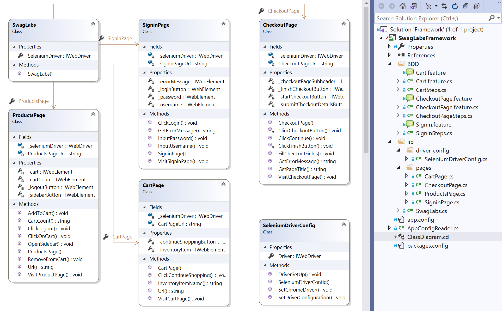
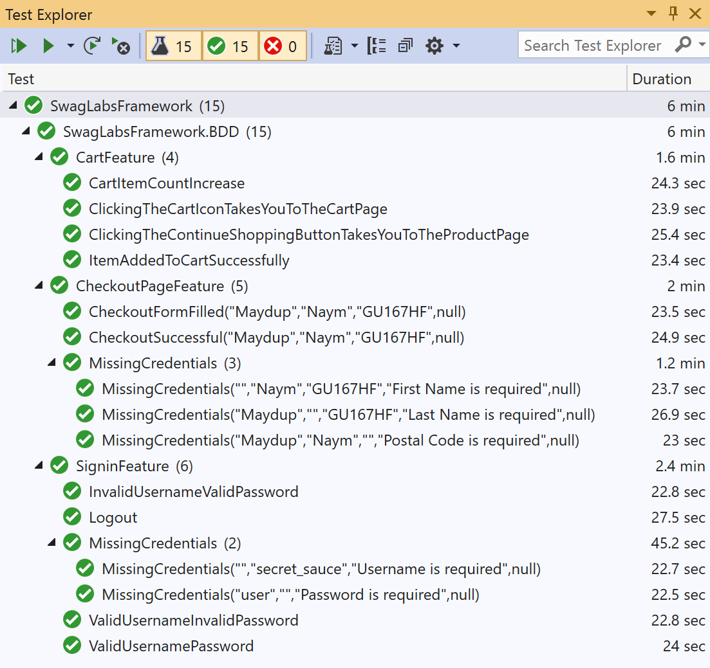
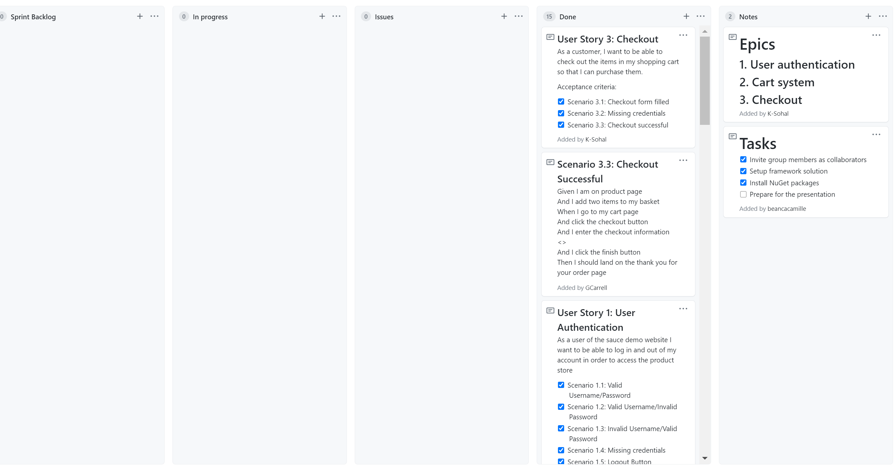

# SWAGLABS Web Testing

## Project Aim

The project aim is to create an automated testing framework for the functionality of the SWAGLABS website using page object models (POM), Selenium and SpecFlow.

## Class diagram and Directory Tree

## Test Results

## Sprint Breakdown

### Sprint 1 - Thursday 21st January 2020

By the end of this sprint we aim to complete all of the epics, project reviews and documentation.

#### Sprint Goals

- [x] Epic 1 - User authentication
- [x] Epic 2 - Cart system
- [x] Epic 3 - Checkout
- [x] Project review
- [x] Project retrospective 
- [x] Documentation

## Project Review
All the user stories were completed and the project aim has been achieved. The use of POM made it easier to navigate through web pages and interact with the web elements.

## Project Retrospective
As a group of 3, the project was finished relatively fast because 1 epic was assigned to each member. Furthermore, substantial planning was done on what features will be tested before the start of the sprint. This meant that each member knew what they were supposed to work on.
Each of us made our own feature branches and made sure to notify the other members when making a pull request, thus preventing major merge conflicts

Overall, the project was completed smoothly by incorporating good collaboration.